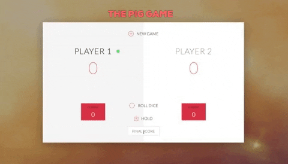

# Pig game made with Javascript

A small project coded in **Javascript** during the course "The complete Javascript course 2020" by Jonas Schmedtmann (Here the link 👉 https://www.udemy.com/course/the-complete-javascript-course/).

The **rules** are simple: roll a dice and hold the score obtained. But pay attention:
- if you roll a 1 you loose your current score and it becomes the next player's turn.
- if you roll two 6 in a row you loose all your current score and your total score. Obviously it becomes the next player's turn.

The goal of the game is to reach (or exceed) the winning score. The first player that do it is the winner.
The winning score is automatically set to 100, but you can change it anytime: type a new winning score in the input field and it will be set the next time you'll press the 'Hold' button.

**Have fun!**

